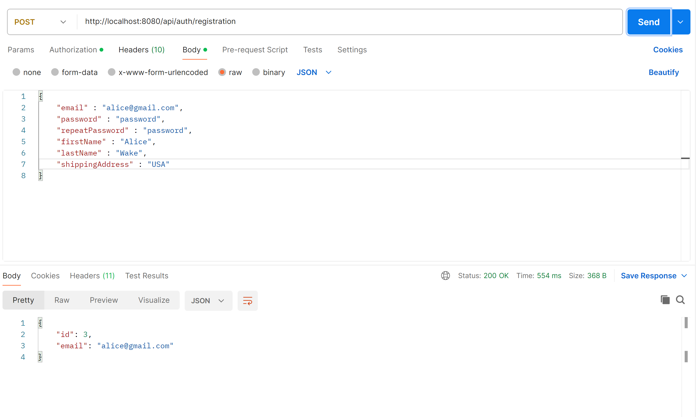
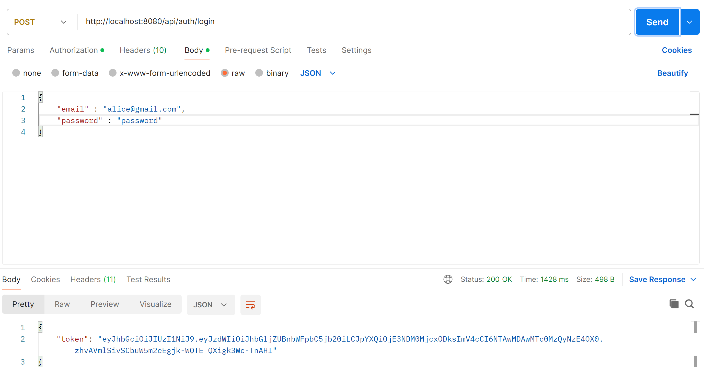

Book store is an app written in Java, which allows us to manage an online store with books.

The project uses many technologies and tools like:
- Docker
- Hibernate
- Liquibase
- Lombok
- Mockito
- Spring Boot
- Spring Data JPA
- Spring Security

Book-store is divided into many packages:
- config
- controller
- dto
- exception
- mapper
- model
- security
- service

Besides that, there is also resource package which contains liquibase database creation along with many data. I also created a lot of tests using
Mockito, SpringBootTest and DataJpaTest to test controller, repository and service with Book, Category and ShoppingCart classes.

In order to use book store, you need to install a program for managing endpoints like Postman which I will use to show you how to use my app.
First of all, go to application.properties file and liquibase.properties and change credentials for user and password to match
yours in your database. I am using MySql in this project. On your local computer, you should create also database called
"book_app". This will ensure that you will connect with your local database, and allow liquibase to fill it with data.
After starting application, launch Postman, and type in your http local host address. By default it is: "http://localhost:8080". 
At first, register new user using /api/auth/registration endpoint with @PostMapping. 

Registration requires from user to type in email, password, repeated password, first name and last name. Shipping address
is optional, since books can be sold as physical or digital versions. There are two roles for users: user and admin. 
Creating new user gives user role, which is also required for selected endpoints. If you want to login as admin, you can
use credentials that I used to create one in liquibase. The location is "src/main/resources/db/changelog/changes/add-new-users.yaml". 
If you want to create your own admin, you should do it directly in your database or add new admin in liquibase. 

Once you register, you can login using /api/auth/login endpoint. This will generate token, which you can use
to access other endpoints.

On the example of the "/api/books" endpoint and @GetMapping, I will show you how to login with token. In authorization
section, choose Bearer token and paste your token, that was generated during login. 

However you can also login using basic auth as authorization instead of token. 

All endpoints you will find in controller package, which is divided into Authentication, Book, Category, Order and
ShoppingCart. Some of them requires to use @RequestBody of certain class or record. You will find them in dto package.
JwtUtil class is used mainly for generating tokens while JwtAuthenticationFilter checks if token is valid. I have set 
very long time for token expiration, which helped for testing and creating this app, but you can change it in application.properties file (jwt.expiration).

This app also supports Docker. The configuration is in Dockerfile and docker-compose.yaml. You can also use your credentials stored in .env file. 
It uses port 8081 so remember to change it in Postman if you are running app through Docker. 
If you want to run it, you can use this command in terminal:
docker run --network my_network -p 8081:8080 -e SPRING_DATASOURCE_URL=jdbc:mysql://host.docker.internal:3306/book_app -e SPRING_DATASOURCE_USERNAME=root -e SPRING_DATASOURCE_PASSWORD=password book_store_app 

Below you can watch a video of me explaining how to use my app:

https://www.youtube.com/watch?v=oHHGhMYNyEA&feature=youtu.be
